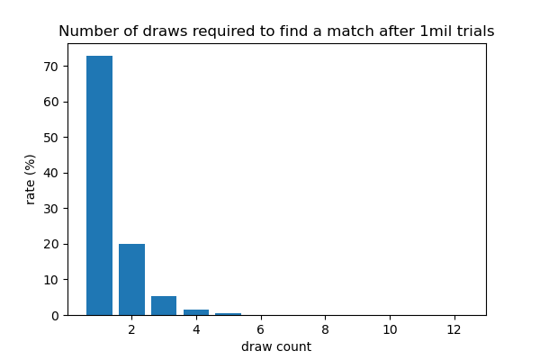

<sup><i>Image source: https://smorgasboardvn.com/products/same-same-hanoi-edition</i></sup>

# Same Same: Hanoi Edition | Card matching game simulation

<b>Same Same: Hanoi Edition</b> is a card game created by Smorgasboard. From their [website](https://smorgasboardvn.com/products/same-same-hanoi-edition):

 >Same Same is a series of icon matching game inspired by local culture. The first of the series is Same Same: Hanoi Edition, a 57 card game populated by 57 dare we say iconic illustrations about things you see and experience while being in Hanoi.
 
Each of the 57 cards displays 8 of a possible 57 pictures. Players receive even portions of the deck, face down, with one extra card placed in the middle, face up. Players simultaneously flip over the top card of their own deck and compare it to the center card. Whenever a player identifies a common picture between their card and the center card, they call out the name of the picture and stack their card in the center. This continues rapid-fire until a player wins by losing all of their cards.

While playing the game with family recently, we noticed that it seemed like you could <i>almost</i> always match your card with the center card, but that this was occasionally impossible, and you would need to wait for another player to place a new card in the center before you had a chance to continue. It was hard to be sure, though, because the game is necessarily fast-paced, and nobody has the time or patience to search back through the deck and try to remember which card may not have matched with which other card.

Some of us, on the other hand, <i>do</i> have the requisite time and patience to write a Python script and find out for sure.

## Q: Does each Same Same card share at least one picture with every other card in the deck?
<b>A: Yes.

How do we know?</b>

I created a Python dictionary where each key is the index position of a given card in the deck, and the value is a list of text descriptions for the eight pictures appearing on the corresponding card. From there, it was straightforward to conduct pairwise comparisons of each 'card' (key-value pair) to every other card, testing whether the pair shared at least one common 'picture' (string). As it turned out, the matching condition held for every possible card pair in the deck.

```
for x in range(57):
    for y in range(57):
        target = deck[x]
        draw = deck[y]
        if match(target, draw):
            continue
        else:
            print('Target {} and draw {} are NOT a match!'.format(x, y))
```
See [source code](code.ipynb) for more.

## Q: If we generate new, random Same Same cards, how likely is it for them to share at least one picture?
<b>A: We could expect a first-try match about 73% of the time.

How do we know?</b>

For this question, I had to move beyond the state of the actual game cards. By choosing a random sample of eight of the possible 57 symbols (without replacement), I created a hypothetical new card to act as the center card. I then generated a second card to represent the player's top card, and then checked for a match. If the cards did not match, I "drew" a new random card (which could also be thought to represent a different player's top card). I repeated this process until a match was found, and then recorded the number of draws I ended up needing.

This entire sequence was then repeated for a total of one million trials.

Here's the number of times each number of draws occurred, expressed again as a percentage of the total trials:

| draw_count | frequency | rate(%) |
|-----------:|----------:|---------|
| 1          | 727030    | 72.7030 |
| 2          | 198478    | 19.8478 |
| 3          | 54293     | 5.4293  |
| 4          | 14711     | 1.4711  |
| 5          | 3920      | 0.3920  |
| 6          | 1177      | 0.1177  |
| 7          | 287       | 0.0287  |
| 8          | 75        | 0.0075  |
| 9          | 20        | 0.0020  |
| 10         | 6         | 0.0006  |
| 11         | 1         | 0.0001  |
| 12         | 2         | 0.0002  |

Here are the percentages visualized as a bar chart:



## Q: How do these results compare to what we'd expect from a sheer probability standpoint?

A: Who has the time to figure THAT out?

* * *

<i>Source code found [here](code.ipynb).

Thanks to [TablesGenerator.com](https://www.tablesgenerator.com/markdown_tables) for Markdown table support.</i>

